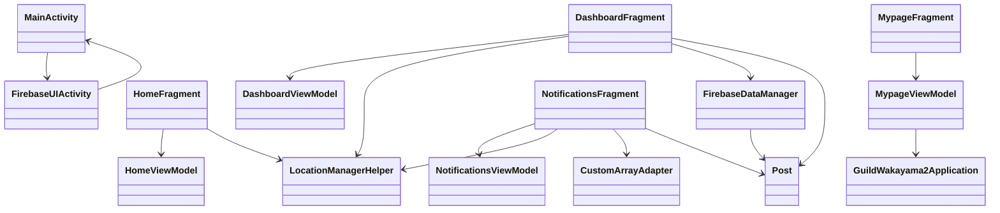

## 1.概要

#### 1. アプリ名

Close Request


#### 2. 動画

<https://youtu.be/slEuJB-ph5o>

#### 3. 紹介スライド

**closerequest.pdfを参照**

#### 4. アプリの目的


#### 5. プロジェクト体制・開発期間

- **開発メンバー**: 2名(他1名は便宜上Aとする)
- **プロジェクトリーダー**: 私
- **企画**: 共同
- **フロントエンド担当**: 私
- **バックエンド担当**: A
- **設計**: 共同
- **デザイン**: 私
- **その他**: 共同
- **開発期間**: 2023年10月～2024年1月（約4ヵ月）

#### 6. 開発内容

研究室の同期と「和歌山イノベーションプログラミングコンテスト」に出場し、和歌山県の高齢化と副業ニーズを解決するお手伝い依頼アプリ「Close Request」を企画・開発しました。

私は主に企画とフロントエンド開発を担当し、高齢者でも直感的に使えるUI/UXを目指して実装しました。開発では、互いのコードの可読性や適切なコメント記述に課題を感じましたが、同期と密に連携し、コミュニケーションを重ね、アプリを完成させることができました。

コンテストでは最終選考まで進み、発表の機会も得ましたが、入賞には至りませんでした。この経験から、明確なペルソナに基づいた機能考案の重要性、チーム開発におけるコードの可読性向上とコミュニケーションの必要性を強く実感しました。


## 2. 開発環境

- **開発開始時期**：2023年10月頃
- **Android Studio**：Hedgehog | 2023.1.1 (Stable)
- **JDKバージョン**：Java 17（Android Studio Hedgehog に同梱）
- **Gradle バージョン**：8.2（Android Gradle Plugin 8.1.2 に対応）
- **Android Gradle Plugin (AGP)**：8.1.2
- **Google Services プラグイン**：4.4.0（`com.google.gms:google-services`）

---

## Android設定

- **アプリケーションID**：`com.example.GuildWakayama2`
- **Namespace**：`com.example.GuildWakayama2`
- **最小SDKバージョン**：API 24（Android 7.0）
- **ターゲットSDKバージョン**：API 33（Android 13）
- **コンパイルSDKバージョン**：API 34（Android 14）
- **Javaバージョン**：Java 8（`sourceCompatibility = 1.8`）

---

## 使用ライブラリ（主なもの）

### Firebase（BOM管理）

- **Firebase BoM**：`com.google.firebase:firebase-bom:32.7.0`
- **Firebase Analytics**：自動でBoMによるバージョン管理
- **Firebase Authentication**：`22.3.0`
- **Realtime Database**：`20.3.0`
- **Firebase UI Auth**：`com.firebaseui:firebase-ui-auth:8.0.2`

### Google Play Services

- **Google Sign-In**：`com.google.android.gms:play-services-auth:20.7.0`

### Android Jetpack

- AppCompat: `1.6.1`
- Material Components: `1.11.0`
- ConstraintLayout: `2.1.4`
- Lifecycle（LiveData/ViewModel）: `2.6.2`
- Navigation Component: `2.7.6`
- Activity: `1.8.2`

### テストライブラリ

- Unit test: `junit:4.13.2`
- AndroidX Test: `androidx.test.ext:junit:1.1.5`, `espresso-core:3.5.1`

---

## ビルド機能

- **ViewBinding**：有効化済み
- **DataBinding**：有効化済み
- **Proguard**：Releaseビルドで `proguard-android-optimize.txt` + `proguard-rules.pro`

---

## 補足

- Firebaseのライブラリは BOM（Bill of Materials）を使って一括でバージョン管理しており、互換性のある組み合わせで安全に使用できます。
- この構成は、2023年10月時点での安定バージョンに基づいています。


## 3. ディレクトリ構成

#### 1. ディレクトリ構成
```
.
├── app/
│ ├── src/
│ │ └── main/
│ │ ├── java/com/example/GuildWakayama2 # アプリに必要なJavaファイル 
│ │ └── res/layout/ # アプリに必要なXMLファイル
│ └── build.gradle # モジュールビルドファイル
├── build.gradle # プロジェクト全体のビルド設定
├── settings.gradle # モジュール管理
└── README.md

```

**※権利などの都合上、res/drawableやres/fontにあった素材ファイルは削除している**

##### 2. 実行に必要な素材

###### 1. res/drawable
```
apuri_icon.png
apuri_icon_1.png
back1.png
back2.png
ic_hand.png
ic_icon.jpg
ic_mypage.png
ic_point.png
ic_profile.png
ic_search.png
ic_ticket.png
ic_write.png
image_change.jpg
image_loading.jpg
image_other.jpg
image_shopping.jpg
image_syazai.png

```

###### 2. res/font

```
gen_gothic_normal.otf
lightnovelpopv2.otf
```

###### 3. src/main

```
ic_launcher-playstore.png
```

## 4. ファイルの参照関係図

#### 1. アーキテクチャ概要：画面遷移・参照関係図

このプロジェクトでは、複数の `Fragment`、`ViewModel`、Firebase 関連クラスなどが連携して、アプリ全体の構成を形作っています。

以下は、各Javaクラスの参照関係を示したクラス図です。



#### 2. 各セクションの説明

##### 1. MainActivity・FirebaseUIActivity  


MainActivity はアプリの主要なエントリーポイントであり、他の画面のホストや、ナビゲーションの中心を担います。  
FirebaseUIActivity は Firebase 認証（ログインやユーザー識別）を行う専用のActivityです。  
両者は相互に参照し合っており、認証後にメイン画面へ遷移する構成になっています。


##### 2. HomeFragment 系


HomeFragment はホーム画面を構成するFragmentです。  
HomeViewModel を参照し、画面表示に必要なデータの取得や状態の管理を行います。  
また、位置情報を扱うために LocationManagerHelper を利用しています。

##### 3. DashboardFragment 系


DashboardFragment はダッシュボード機能を提供する画面で、ユーザーの活動状況や統計情報を表示する場面に用いられます。  
DashboardViewModel を通じてデータを操作し、画面に反映させています。  
FirebaseDataManager は Firebase とのデータ通信を担当し、その中で Post データモデルを使用しています。  
LocationManagerHelper も利用し、位置情報ベースの機能にも対応しています。


##### 4. NotificationsFragment 系


NotificationsFragment は通知履歴やお知らせなどを表示する画面です。  
NotificationsViewModel で通知データを管理します。  
独自の CustomArrayAdapter によってリスト表示がカスタマイズされています。  
通知内容は Post モデルを介して表現され、位置情報機能にも LocationManagerHelper を用います。


##### 5. MypageFragment 系
MypageFragment はユーザーの個人設定画面を担い、ユーザー情報の表示やアプリ設定の変更が行えます。  
MypageViewModel がバックグラウンドでデータを保持し、GuildWakayama2Application クラスを参照することで、アプリ全体の設定情報などにアクセスしています。

##### 6. LocationManagerHelper
LocationManagerHelper は位置情報に関する共通機能を提供するユーティリティクラスです。  
HomeFragment・DashboardFragment・NotificationsFragment など複数の画面で再利用されています。

##### 7. Post・FirebaseDataManager・CustomArrayAdapter
Post: 投稿情報や通知メッセージの内容を表現するデータモデルクラス。  
FirebaseDataManager: Firebaseとのデータ送受信を処理する中核的なマネージャークラス。DashboardFragment や Post クラスと密接に関係します。  
CustomArrayAdapter: 通知一覧などを表示するためにカスタマイズされたArrayAdapterで、NotificationsFragment から使用されます。

#### 3. 備考

- 各FragmentがViewModelを参照し、UIロジックとビジネスロジックを分離する MVVM構成 を基盤にしています。

- 位置情報 (LocationManagerHelper) や投稿データ (Post) など、共通ユーティリティ・モデルの再利用性 が高く設計されています。

- Firebaseとの接続やデータ操作に関しては、FirebaseUIActivity や FirebaseDataManager に責務が集中しており、機能分割が明確です。
